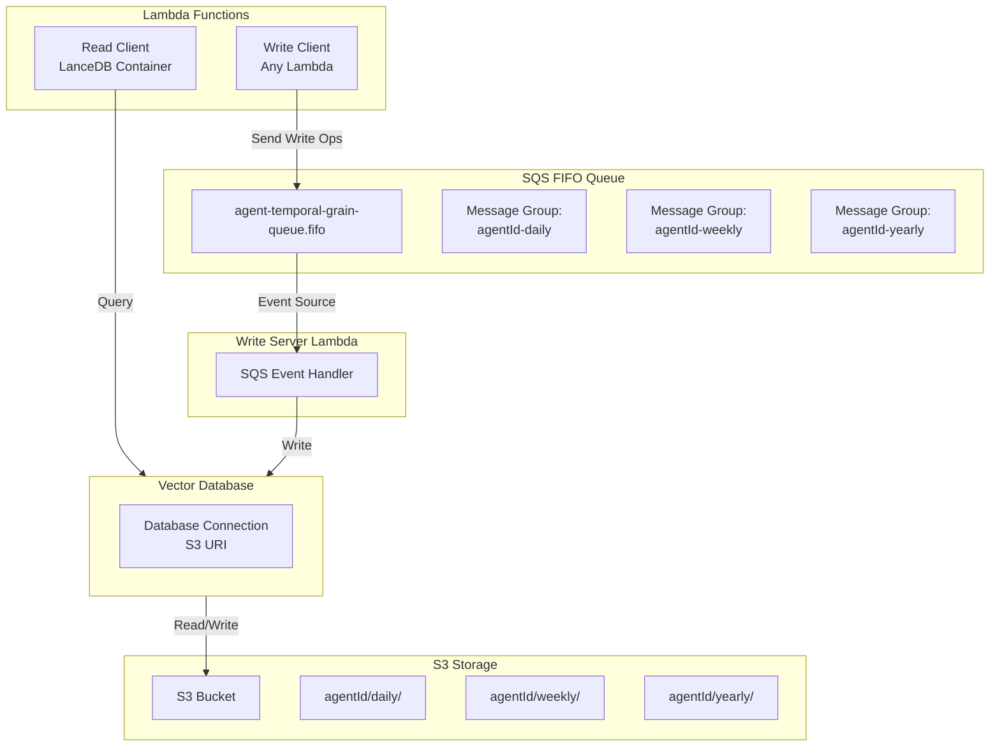

# Vector Database

## Overview

The vector database system provides a distributed, temporal storage solution for agent facts using LanceDB with S3 as the storage backend. Each agent has multiple temporal databases (daily, weekly, monthly, quarterly, yearly) for storing compressed facts. The system ensures write serialization through SQS FIFO queues while providing low-latency read access.

### Purpose

- Store agent conversation facts in a compressed, temporal format
- Enable efficient vector similarity search across agent knowledge
- Support temporal queries (date range filtering)
- Provide scalable, distributed storage using S3

### Use Cases

- Agent memory and fact storage
- Temporal knowledge organization
- Vector similarity search for context retrieval
- Long-term agent conversation summarization

## Architecture



### Key Components

1. **Read Client**: Direct query access to LanceDB (only in `lancedb` container image)
2. **Write Client**: Sends write operations to SQS FIFO queue
3. **Write Server**: Processes SQS messages and writes to LanceDB
4. **SQS FIFO Queue**: Ensures serialized writes per database via message groups
5. **S3 Storage**: Backend storage for LanceDB databases

## Getting Started

### Prerequisites

- Lambda function using `lancedb` container image (for read access)
- S3 bucket configured with appropriate credentials
- SQS FIFO queue configured in `app.arc`

### Basic Usage

#### Reading from Vector Database

```typescript
import { query } from "@utils/vectordb/readClient";

// Simple query
const results = await query("agent-123", "daily", {
  limit: 10,
});

// Vector similarity search
const similarResults = await query("agent-123", "daily", {
  vector: [0.1, 0.2, 0.3, ...],
  limit: 5,
});

// With temporal filter
const filteredResults = await query("agent-123", "daily", {
  temporalFilter: {
    startDate: "2024-01-01T00:00:00Z",
    endDate: "2024-01-31T23:59:59Z",
  },
  limit: 20,
});
```

#### Writing to Vector Database

```typescript
import { insert, update, remove } from "@utils/vectordb/writeClient";

// Insert facts
await insert("agent-123", "daily", [
  {
    id: "fact-1",
    content: "User asked about pricing",
    embedding: [0.1, 0.2, 0.3, ...],
    timestamp: "2024-01-15T10:00:00Z",
    metadata: { source: "conversation" },
  },
]);

// Update facts
await update("agent-123", "daily", [
  {
    id: "fact-1",
    content: "User asked about pricing and features",
    embedding: [0.2, 0.3, 0.4, ...],
    timestamp: "2024-01-15T10:05:00Z",
    metadata: { source: "conversation", updated: true },
  },
]);

// Delete facts
await remove("agent-123", "daily", ["fact-1", "fact-2"]);
```

## API Reference

### Read Client

#### `query(agentId, temporalGrain, options?)`

Query the vector database for facts.

**Parameters:**
- `agentId` (string): Agent identifier
- `temporalGrain` (TemporalGrain): Temporal grain (`daily`, `weekly`, `monthly`, `quarterly`, `yearly`)
- `options` (QueryOptions, optional): Query options

**Returns:** `Promise<QueryResult[]>`

**QueryOptions:**
```typescript
interface QueryOptions {
  vector?: number[];           // Query vector for similarity search
  filter?: string;             // SQL-like filter for metadata
  limit?: number;              // Maximum results (default: 100, max: 1000)
  temporalFilter?: {           // Date range filter
    startDate?: string;        // ISO 8601 date string
    endDate?: string;          // ISO 8601 date string
  };
}
```

**Example:**
```typescript
const results = await query("agent-123", "daily", {
  vector: [0.1, 0.2, 0.3],
  filter: "metadata.source = 'conversation'",
  limit: 10,
  temporalFilter: {
    startDate: "2024-01-01T00:00:00Z",
    endDate: "2024-01-31T23:59:59Z",
  },
});
```

### Write Client

#### `insert(agentId, temporalGrain, records)`

Insert fact records into the vector database.

**Parameters:**
- `agentId` (string): Agent identifier
- `temporalGrain` (TemporalGrain): Temporal grain
- `records` (FactRecord[]): Records to insert

**Returns:** `Promise<void>`

#### `update(agentId, temporalGrain, records)`

Update fact records in the vector database.

**Parameters:**
- `agentId` (string): Agent identifier
- `temporalGrain` (TemporalGrain): Temporal grain
- `records` (FactRecord[]): Records to update

**Returns:** `Promise<void>`

#### `remove(agentId, temporalGrain, recordIds)`

Delete fact records from the vector database.

**Parameters:**
- `agentId` (string): Agent identifier
- `temporalGrain` (TemporalGrain): Temporal grain
- `recordIds` (string[]): IDs of records to delete

**Returns:** `Promise<void>`

**Note:** Also exported as `delete` for consistency.

### Agent Removal

#### `removeAgentDatabases(agentId)`

Remove all vector databases for an agent (all temporal grains).

**Parameters:**
- `agentId` (string): Agent identifier

**Returns:** `Promise<void>`

**Example:**
```typescript
import { removeAgentDatabases } from "@utils/vectordb/agentRemoval";

// Remove all databases when agent is deleted
await removeAgentDatabases("agent-123");
```

## Temporal Grains

Temporal grains organize facts by time periods:

- **daily**: Facts for a single day
- **weekly**: Aggregated facts for a week
- **monthly**: Aggregated facts for a month
- **quarterly**: Aggregated facts for a quarter
- **yearly**: Aggregated facts for a year

### Database Organization

Each agent has 5 databases (one per temporal grain):
- `vectordb/{agentId}/daily/`
- `vectordb/{agentId}/weekly/`
- `vectordb/{agentId}/monthly/`
- `vectordb/{agentId}/quarterly/`
- `vectordb/{agentId}/yearly/`

### When to Use Each Grain

- **daily**: Store individual conversation facts as they occur
- **weekly**: Store weekly summaries (created by summarization agent)
- **monthly**: Store monthly summaries
- **quarterly**: Store quarterly summaries
- **yearly**: Store yearly summaries

## Query Patterns

### Vector Similarity Search

Find facts similar to a query vector:

```typescript
const results = await query("agent-123", "daily", {
  vector: queryEmbedding,
  limit: 5,
});
```

### Metadata Filtering

Filter facts by metadata:

```typescript
const results = await query("agent-123", "daily", {
  filter: "metadata.source = 'conversation' AND metadata.importance > 0.8",
  limit: 20,
});
```

### Temporal Filtering

Query facts within a date range:

```typescript
const results = await query("agent-123", "daily", {
  temporalFilter: {
    startDate: "2024-01-01T00:00:00Z",
    endDate: "2024-01-31T23:59:59Z",
  },
});
```

### Combining Filters

Combine multiple filters:

```typescript
const results = await query("agent-123", "daily", {
  vector: queryEmbedding,
  filter: "metadata.source = 'conversation'",
  temporalFilter: {
    startDate: "2024-01-01T00:00:00Z",
  },
  limit: 10,
});
```

### Performance Considerations

- Vector similarity search is faster than metadata filtering
- Temporal filters are applied in memory after query execution
- Limit results to reduce memory usage and improve performance
- Use appropriate temporal grain for your query scope

## Write Operations

### Inserting Facts

Facts are inserted asynchronously via SQS FIFO queue:

```typescript
await insert("agent-123", "daily", [
  {
    id: "fact-1",
    content: "User asked about features",
    embedding: generateEmbedding("User asked about features"),
    timestamp: new Date().toISOString(),
    metadata: {
      source: "conversation",
      userId: "user-456",
    },
  },
]);
```

### Updating Facts

Update existing facts (replaces by ID):

```typescript
await update("agent-123", "daily", [
  {
    id: "fact-1",
    content: "User asked about features and pricing",
    embedding: generateEmbedding("User asked about features and pricing"),
    timestamp: new Date().toISOString(),
    metadata: {
      source: "conversation",
      userId: "user-456",
      updated: true,
    },
  },
]);
```

### Deleting Facts

Delete facts by ID:

```typescript
await remove("agent-123", "daily", ["fact-1", "fact-2"]);
```

### Message Group Serialization

SQS FIFO queue ensures only one write operation per database is processed at a time:
- Message group ID: `{agentId}-{temporalGrain}`
- Ensures serialized writes per database
- Prevents race conditions

### Error Handling and Retries

- Write operations are automatically retried on failure
- Failed messages go to dead-letter queue after max retries
- Read operations should handle connection errors gracefully

## Configuration

### Environment Variables

**S3 Bucket Configuration:**
- `HELPMATON_VECTORDB_S3_BUCKET_PRODUCTION`: Production S3 bucket name
- `HELPMATON_VECTORDB_S3_BUCKET_STAGING`: Staging S3 bucket name
- Fallback: `HELPMATON_S3_BUCKET_PRODUCTION` / `HELPMATON_S3_BUCKET_STAGING`

**S3 Credentials:**
- `HELPMATON_S3_ACCESS_KEY_ID`: S3 access key
- `HELPMATON_S3_SECRET_ACCESS_KEY`: S3 secret key
- `HELPMATON_S3_REGION`: S3 region (default: `eu-west-2`)

### Queue Configuration

Defined in `app.arc`:

```arc
@queues
agent-temporal-grain-queue
  fifo true
  visibilityTimeout 60
  messageRetentionPeriod 1209600
```

### Connection Settings

- **Default Query Limit**: 100 results
- **Max Query Limit**: 1000 results
- **Connection Timeout**: 30 seconds
- **Default S3 Region**: `eu-west-2`

## Agent Management

### Creating Databases

Databases are created automatically on first write operation. No explicit creation needed.

### Removing Agent Databases

When an agent is deleted, remove all associated databases:

```typescript
import { removeAgentDatabases } from "@utils/vectordb/agentRemoval";

// In agent deletion handler
await removeAgentDatabases(agentId);
```

This deletes all temporal grain databases for the agent.

### Best Practices

1. **Use appropriate temporal grain**: Store facts in the most granular grain (daily) and aggregate upward
2. **Batch writes**: Group multiple facts in a single insert operation
3. **Set meaningful metadata**: Include source, importance, and other relevant fields
4. **Use consistent IDs**: Use deterministic IDs for facts that may be updated
5. **Handle errors**: Always handle connection and query errors gracefully

## Troubleshooting

### Common Issues

#### "S3 bucket name not configured"

**Solution**: Set `HELPMATON_VECTORDB_S3_BUCKET_PRODUCTION` or `HELPMATON_VECTORDB_S3_BUCKET_STAGING` environment variable.

#### "Vector database query failed"

**Possible causes:**
- Database doesn't exist (first write hasn't occurred)
- S3 credentials incorrect
- Network connectivity issues

**Solution**: Check S3 credentials, verify bucket exists, check network connectivity.

#### "Table not found"

**Solution**: This is expected for new databases. The first insert operation will create the table.

#### Write operations not processing

**Possible causes:**
- SQS queue not configured
- Lambda function not subscribed to queue
- Queue permissions incorrect

**Solution**: Verify queue configuration in `app.arc`, check Lambda event source mapping, verify IAM permissions.

### Error Messages

- `"S3 bucket name not configured"`: Missing environment variable
- `"Vector database query failed"`: Connection or query error
- `"Invalid message format"`: SQS message body parsing error
- `"Insert operation requires records"`: Missing records in insert message
- `"Unknown operation"`: Invalid operation type in write message

### Debugging Tips

1. **Check logs**: Review CloudWatch logs for Lambda functions
2. **Verify S3 access**: Test S3 bucket access with AWS CLI
3. **Check queue depth**: Monitor SQS queue metrics
4. **Verify message format**: Check SQS message body structure
5. **Test connections**: Verify LanceDB can connect to S3

### Performance Optimization

1. **Use connection caching**: Read client caches connections per database
2. **Limit query results**: Use appropriate limit values
3. **Batch operations**: Group multiple writes in single operation
4. **Choose right grain**: Query the most specific temporal grain needed
5. **Index metadata**: Consider indexing frequently queried metadata fields

## Examples

### Complete Usage Example

```typescript
import { query, insert } from "@utils/vectordb/readClient";
import { insert as insertFacts } from "@utils/vectordb/writeClient";

// Store a conversation fact
await insertFacts("agent-123", "daily", [
  {
    id: `fact-${Date.now()}`,
    content: "User asked: What are your features?",
    embedding: await generateEmbedding("User asked: What are your features?"),
    timestamp: new Date().toISOString(),
    metadata: {
      source: "conversation",
      userId: "user-456",
      messageId: "msg-789",
    },
  },
]);

// Later, query for similar facts
const similarFacts = await query("agent-123", "daily", {
  vector: await generateEmbedding("features"),
  limit: 5,
});

// Query recent facts
const recentFacts = await query("agent-123", "daily", {
  temporalFilter: {
    startDate: new Date(Date.now() - 24 * 60 * 60 * 1000).toISOString(),
  },
  limit: 20,
});
```

### Integration Pattern

```typescript
// In agent conversation handler
async function handleAgentMessage(agentId: string, message: string) {
  // Generate embedding
  const embedding = await generateEmbedding(message);
  
  // Store fact
  await insert("agent-123", "daily", [
    {
      id: `fact-${Date.now()}-${Math.random()}`,
      content: message,
      embedding,
      timestamp: new Date().toISOString(),
      metadata: {
        source: "conversation",
        type: "user_message",
      },
    },
  ]);
  
  // Query similar past facts for context
  const context = await query("agent-123", "daily", {
    vector: embedding,
    limit: 5,
  });
  
  // Use context in agent response
  return generateResponse(message, context);
}
```

### Real-World Scenario: Agent Memory

```typescript
// Store daily facts
async function storeDailyFact(agentId: string, fact: string) {
  const embedding = await generateEmbedding(fact);
  await insert(agentId, "daily", [
    {
      id: `daily-${Date.now()}`,
      content: fact,
      embedding,
      timestamp: new Date().toISOString(),
      metadata: { type: "daily_fact" },
    },
  ]);
}

// Query agent memory
async function queryAgentMemory(
  agentId: string,
  queryText: string,
  days: number = 7
) {
  const embedding = await generateEmbedding(queryText);
  const startDate = new Date(Date.now() - days * 24 * 60 * 60 * 1000);
  
  return await query(agentId, "daily", {
    vector: embedding,
    temporalFilter: {
      startDate: startDate.toISOString(),
    },
    limit: 10,
  });
}
```

## Next Steps

Future enhancements planned:

- Agent summarization service (daily → weekly → monthly → quarterly → yearly)
- Query optimization and indexing strategies
- Monitoring and alerting for write queue depth
- Database compaction/compression strategies

